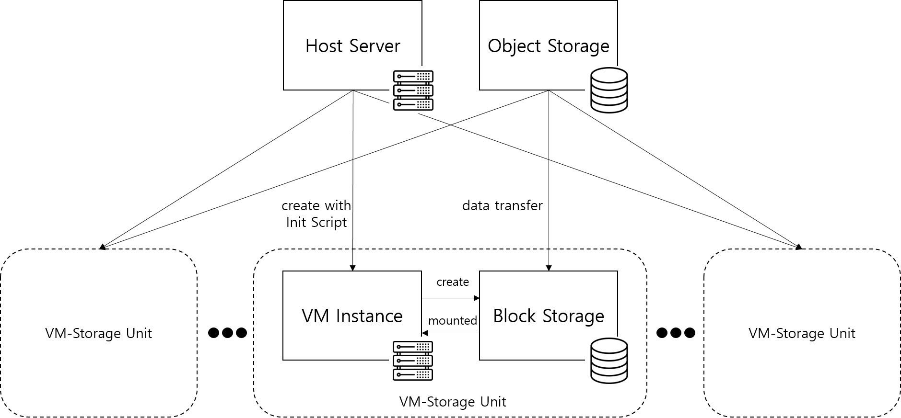

# 네이버 클라우드 플랫폼
---
## 네이버 클라우드 플랫폼의 서비스
### 서버
| 서버 타입 | 설명 | 추천 용도 | 기본 옵션/요금 (VAT 별도) |
|-----------|------|------------|------------------|
| **Micro-g1** | - 네이버 클라우드 플랫폼 체험용 서버 - Linux 계열 운영체제만 사용할 수 있으며, 추가 디스크는 사용 불가 - 가용성 및 성능을 보장하지 않으며, 클라우드 플랫폼의 리소스 상황에 따라 Micro 서버 생성이 임의로 제한됨 | 서비스 체험용 | vCPU 1개, 메모리 1GB, 디스크 50GB 19원/시간, 13,000원/월|
| **Compact-g1** | - 가격 부담을 줄인 저사양 서버 - 운영하는 서비스가 높은 성능을 요구하지 않고, 서버 운영 비용 부담이 적음 | 개발 테스트 서버, 개인 홈페이지 운영, 소규모 웹사이트 운영 | vCPU 1개, 메모리 2GB, 디스크 50GB 37원/시간, 26,000원/월 |
| **Standard-g1** | - 다양한 IT 비즈니스에 활용할 수 있는 범용 서버 - 균형 잡힌 서버 사양, 높은 가용성과 서비스 안정성을 제공 | 중/대규모 모바일 및 웹 서비스 운영, 게임/미디어/금융 서비스 운영 | vCPU 2개, 메모리 4GB, 디스크 50GB 96원/시간, 69,000원/월 |
| **High Memory-g1** | - 많은 양의 메모리를 요구하는 데이터 애플리케이션을 운영할 때 적합 | 머신/딥 러닝용 처리서버, 고성능 웹서버, HPC / 배치 처리, 비디오 인코딩 | vCPU 8개, 메모리 64GB, 디스크 50GB 673원/시간, 484,000원/월 |
| **CPU Intensive-g1 Server** | - 고성능 CPU를 장착하여 많은 연산이 필요한 경우 적합 - AVX-512 명령어를 통해 벡터 연산 최적화 가능 |머신/딥 러닝용 처리서버, 고성능 웹서버, HPC / 배치 처리, 비디오 인코딩 | vCPU 2개, 메모리 4GB, 디스크 50GB 104원/시간, 74,800원/월 |
| **Standard-g2** | - vCPU 대비 메모리 비율을 균형 있게 할당하여 다양한 워크 로드에 적합한 서비스 제공 | 데이터베이스, 서버 개인 홈페이지 운영 | vCPU 2개, 메모리 8GB, 디스크 50GB 119원/시간, 85,120원/월 |
| **High CPU-g2 Server** | - 메모 대비 vCPU 비율을 높여 컴퓨팅 집약적 워크 로드에 적합한 서비스 제공 |과학적 모델링, 게임 서버 | vCPU 2개, 메모리 4GB, 디스크 50GB 96원/시간, 69,120원/월 |
| **High Memory-g2 Server** | - 대용량 데이터 처리 등과 같은 메모리 집약적 워크 로드에 적합한 서비스 제공 |고성능 데이터베이스 서버, 대규모 게임 서비스 | vCPU 2개, 메모리 16GB, 디스크 50GB 163원/시간, 117,120원/월 |
### 스토리지
#### Object Storage
- 구글 클라우드 플랫폼의 클라우드 스토리지 버킷에 대응한다.
- 중요한 데이터를 보관하거나 서비스 복구에 사용할 백업 데이터를 보관하기에 적합하다.
- AWS S3의 API/CLI를 호환하여, 데이터를 쉽게 업로드/다운로드 할 수 있다.
##### Object Storage 요금
| 서비스 | 요금 (VAT 별도) |
|--------|------|
| 1PB 이하 데이터 저장 | GB당 28원/월 |
| 1PB 이상 데이터 저장 | GB당 26원/월 |
| PUT, COPY, POST 또는 LIST 요청 API | 0.0045원/건 |
| GET 및 기타 모든 요청 API | 0.0004원/건 |
| DELETE 요청 API | 무료 |
| 인바운드 트래픽 | 무료 |
| 5TB 이하 아웃바운드 트래픽 | GB당 100원 |
| 5TB 초과 10TB 이하 아웃바운드 트래픽 | GB당 90원 |
| 10TB 초과 30TB 이하 아웃바운드 트래픽 | GB당 80원 |
| 30TB 초과 아웃바운드 트래픽 | GB당 70원 |
#### Archive Storage
- Object Storage에 비해 데이터 저장 비용은 적지만, API 비용이 크다.
- Swift CLI를 지원하여 데이터를 업로드/다운로드 할 수 있다.
- Object Storage와 Archive Storage 중 어떤 것이 비용 절감 차원에서 더 적합한지 고려가 필요할 것으로 보인다.
##### Archive Storage 요금
| 서비스 | 요금 (VAT 별도) |
|--------|------|
| 데이터 저장 | GB당 5.5원/월 |
| PUT, COPY, POST 또는 LIST 요청 API | 0.06원/건 |
| GET 및 기타 모든 요청 API | 0.06원/건 |
| DELETE 요청 API | 0.06원/건 |
| 인바운드 트래픽 | 무료 |
| 5TB 이하 아웃바운드 트래픽 | GB당 100원 |
| 5TB 초과 10TB 이하 아웃바운드 트래픽 | GB당 90원 |
| 10TB 초과 30TB 이하 아웃바운드 트래픽 | GB당 80원 |
| 30TB 초과 아웃바운드 트래픽 | GB당 70원 |
#### Block Storage
- 구글 클라우드 플랫폼의 클라우드 스토리지 디스에 대응한다.
- HDD와 SDD 중 선택할 수 있다.
- 스토리지에 저장된 데이터를 간단하게 백업하거나 복제해 다른 서버에 옮길 수 있으며 스냅샷에 백업해둔 데이터로 스토리지를 다시 생성해 복구할 수 있다.
##### Block Storage 요금
| 스토리지 종류 | 요금 (VAT 별도) |
|--------|------|
| HDD | GB당 0.08원/시간 |
| SDD | GB당 0.16원/시간 |
#### NAS
- NAS에 저장한 데이터를 NAS 볼륨과 연결한 여러 개의 서버와 공유하고 관리할 수 있다.
- 데이터의 자유로운 편집에 대한 우려가 있으므로 본 과제에서는 적합하지 않다고 보인다.
- GB당 0.1원/시간 (VAT 별도) 요금으로 서비스를 제공한다.
## 네이버 클라우드 플랫폼 기반 환경 구축

- Host Server: Standard-g1, 2vCPU, 4GB Mem, 50GB Disk
- VM Instance: Standard-g1, 4vCPU, 32GB Mem, 50GB Disk
- Object Storage: 약 2500GB
- Block Storage: 500GB
- Init Script: 사용자가 미리 작성한 스크립트를 서버가 생성되면서 자동으로 실행한다.
### Imputed Genotype을 이용한 SAIGE 소요 시간
- Step0: 7시간
- Step1: 0.5시간
- Step2: 185시간
### Imputed Genotype을 이용한 SAIGE 소요 비용 
- Host Server: 69,000원/월 (고정 비용)
- VM Instance: 345원 * 약 200시간(Step 0, 1, 2의 시간 합 + 데이터 통신 시간) = 69,000원
- Object Storage 저장 요금: 28원 * 약 2,500GB = 70,000원 (고정 비용)
- Object Storage API 요금(GET): 약 2,500GB * 0.0004원 = 1원
- Block Storage: 약 200시간 * 0.08원 * 500GB = 8,000원
- 총 합: (고정 비용 139,000원) + (Imputed Genotype을 이용한 SAIGE 분석 1회 시 약 77,000원) * (분석 횟수 n회) =  (139,000 + 77,000*n)원
## 부록 (Init Script)
#!/bin/bash
set -e
exec > >(tee /var/log/startup-script.log) 2>&1
timestamp=$(date)"start"
echo ${timestamp}
curl -L https://github.com/stedolan/jq/releases/download/jq-1.6/jq-linux64 -o /usr/local/bin/jq
chmod a+x /usr/local/bin/jq

apt install sshpass
sshpass -p '********' scp -o StrictHostKeyChecking=no -P 1028 -r root@27.96.129.251:/root/cli_linux /root/
cd /root/cli_linux

export AWS_ACCESS_KEY_ID="**********"
export AWS_SECRET_ACCESS_KEY="******************"
echo -e "${AWS_ACCESS_KEY_ID}\n${AWS_SECRET_ACCESS_KEY}\n\n" | ./ncloud configure

serverInstanceNo=$(./ncloud server getServerInstanceList | jq -r '.getServerInstanceListResponse.serverInstanceList[] | select(.serverName == "mktest") | .serverInstanceNo')

apt install python-pip -y
pip install awscli==1.15.85

echo -e "${AWS_ACCESS_KEY_ID}\n${AWS_SECRET_ACCESS_KEY}\n\n" | aws configure

blockInstanceNo=$(./ncloud server createBlockStorageInstance --blockStorageSize 500 --serverInstanceNo ${serverInstanceNo} | jq -r  '.createBlockStorageInstanceResponse.blockStorageInstanceList[] | select(.serverName == "mktest") | .blockStorageInstanceNo')
DIRECTORY="/dev/xvdb"
while true; do
    if [ -e "$DIRECTORY" ]; then
        echo "Can't find directory"
        break
    else
        echo "Found directory"
    fi
    sleep 5
done
echo "escape while loop"

echo -e "n\np\n\n\n\nw\n" | fdisk /dev/xvdb
mkfs.ext4 /dev/xvdb1
mkdir /mnt/a
mount /dev/xvdb1 /mnt/a
DIRECTORY="/mnt/a"
while true; do
    if [ -e "$DIRECTORY" ]; then
        echo "Can't find directory"
        break
    else
        echo "Found directory"
    fi
    sleep 5
done
echo "escape while loop"

mkdir -p /mnt/a/data1/SAIGE/SAIGE_Step1/
mkdir -p /mnt/a/data1/SAIGE/SAIGE_Step2/output

aws --endpoint-url=https://kr.object.ncloudstorage.com s3api get-object --bucket leelabsgtest --key UKB_step1.fam  /mnt/a/data1/SAIGE/SAIGE_Step1/UKB_step1.fam
aws --endpoint-url=https://kr.object.ncloudstorage.com s3api get-object --bucket leelabsgtest --key UKB_step1.bed  /mnt/a/data1/SAIGE/SAIGE_Step1/UKB_step1.bed
aws --endpoint-url=https://kr.object.ncloudstorage.com s3api get-object --bucket leelabsgtest --key UKB_step1.bim  /mnt/a/data1/SAIGE/SAIGE_Step1/UKB_step1.bim

cd /root
sudo apt-get update
sudo apt-get install docker.io -y

newgrp docker
docker pull wzhou88/saige:1.3.0

cd /mnt/a/data1/SAIGE/SAIGE_Step1
timestamp=$(date)"step0start"
echo ${timestamp}
docker run -w /mnt/a/data1/SAIGE/SAIGE_Step1 -v /mnt/a/data1/SAIGE/SAIGE_Step1/:/mnt/a/data1/SAIGE/SAIGE_Step1/ wzhou88/saige:1.3.0 createSparseGRM.R --plinkFile=/mnt/a/data1/SAIGE/SAIGE_Step1/UKB_step1       --nThreads=4   --outputPrefix=/mnt/a/data1/SAIGE/SAIGE_Step1/sparseGRM --numRandomMarkerforSparseKin=2000 --relatednessCutoff=0.125
timestamp=$(date)"step0end"
echo ${timestamp}
aws --endpoint-url=https://kr.object.ncloudstorage.com s3api get-object --bucket leelabsgtest --key HDL_imputed_pheno.txt /mnt/a/data1/SAIGE/SAIGE_Step1/HDL_imputed_pheno.txt

mkdir /mnt/a/data1/SAIGE/SAIGE_Step1/output
timestamp=$(date)"step1start"
echo ${timestamp}
docker run -w /mnt/a/data1/SAIGE/SAIGE_Step1 -v /mnt/a/data1/SAIGE/SAIGE_Step1/:/mnt/a/data1/SAIGE/SAIGE_Step1/ wzhou88/saige:1.3.0 step1_fitNULLGLMM.R \
--useSparseGRMtoFitNULL=TRUE \
--sparseGRMFile=/mnt/a/data1/SAIGE/SAIGE_Step1/sparseGRM_relatednessCutoff_0.125_2000_randomMarkersUsed.sparseGRM.mtx \
--sparseGRMSampleIDFile=/mnt/a/data1/SAIGE/SAIGE_Step1/sparseGRM_relatednessCutoff_0.125_2000_randomMarkersUsed.sparseGRM.mtx.sampleIDs.txt \
--plinkFile=/mnt/a/data1/SAIGE/SAIGE_Step1/UKB_step1 \
--phenoFile=/mnt/a/data1/SAIGE/SAIGE_Step1/HDL_imputed_pheno.txt \
--phenoCol=HDL \
--covarColList=Sex,Age,PC1,PC2,PC3,PC4,PC5,PC6,PC7,PC8,PC9,PC10  \
--sampleIDColinphenoFile=eid  \
--traitType=quantitative \
--invNormalize=TRUE \
--outputPrefix=./output/HDL_imputed_Step1 \
--nThreads=4 \
--LOCO=TRUE \
--FemaleCode=2 \
--MaleCode=1 \
--IsOverwriteVarianceRatioFile=TRUE

timestamp=$(date)"step1end"
echo ${timestamp}

cd /mnt/a/data1/SAIGE/SAIGE_Step2

aws --endpoint-url=https://kr.object.ncloudstorage.com s3api get-object --bucket leelabsgtest --key ukb45227_imp_chr1_v3_s487296.sample /mnt/a/data1/SAIGE/SAIGE_Step2/ukb45227_imp_chr1_v3_s487296.sample
timestamp=$(date)"step2start"
echo ${timestamp}
for ((chr=22; chr<=22; chr++))
do
aws --endpoint-url=https://kr.object.ncloudstorage.com s3api get-object --bucket leelabsgtest --key ukb_imp_chr${chr}_v3.bgen.bgi /mnt/a/data1/SAIGE/SAIGE_Step2/ukb_imp_chr${chr}_v3.bgen.bgi
aws --endpoint-url=https://kr.object.ncloudstorage.com s3api get-object --bucket leelabsgtest --key ukb_imp_chr${chr}_v3.bgen /mnt/a/data1/SAIGE/SAIGE_Step2/ukb_imp_chr${chr}_v3.bgen

docker run -w /mnt/a/data1/SAIGE/ -v /mnt/a/data1/SAIGE/:/mnt/a/data1/SAIGE/ wzhou88/saige:1.3.0 step2_SPAtests.R   \
--bgenFile=/mnt/a/data1/SAIGE/SAIGE_Step2/ukb_imp_chr${chr}_v3.bgen \
--bgenFileIndex=/mnt/a/data1/SAIGE/SAIGE_Step2/ukb_imp_chr${chr}_v3.bgen.bgi        \
--minMAF=0.0001 \
--minMAC=10     \
"--chrom="$(printf "%02d" $chr)  \
--GMMATmodelFile=/mnt/a/data1/SAIGE/SAIGE_Step1/output/HDL_imputed_Step1.rda        \
--sampleFile=/mnt/a/data1/SAIGE/SAIGE_Step2/ukb45227_imp_chr1_v3_s487296.sample     \
--varianceRatioFile=/mnt/a/data1/SAIGE/SAIGE_Step1/output/HDL_imputed_Step1.varianceRatio.txt       \
--SAIGEOutputFile=/mnt/a/data1/SAIGE/SAIGE_Step2/output/chr${chr}_HDL_imputed_output        \
--LOCO=FALSE

rm /mnt/a/data1/SAIGE/SAIGE_Step2/ukb_imp_chr${chr}_v3.bgen
rm /mnt/a/data1/SAIGE/SAIGE_Step2/ukb_imp_chr${chr}_v3.bgen.bgi
done
timestamp=$(date)"step2end"
echo ${timestamp}
for ((chr=22; chr<=22; chr++))
do
 aws --endpoint-url=https://kr.object.ncloudstorage.com s3api put-object --bucket leelabsgtest --key chr${chr}_HDL_imputed_output --body /mnt/a/data1/SAIGE/SAIGE_Step2/output/chr${chr}_HDL_imputed_output
 aws --endpoint-url=https://kr.object.ncloudstorage.com s3api put-object --bucket leelabsgtest --key chr${chr}_HDL_imputed_output.index --body /mnt/a/data1/SAIGE/SAIGE_Step2/output/chr${chr}_HDL_imputed_output.index
done

umount -l /mnt/a
